# Project Report: Salon Booking System

**Project Title:** Salon Booking System

**Technology Stack:** Node.js · Express.js · PostgreSQL · Sequelize · jQuery

**Report Date:** February 2026

---

## Table of Contents

1. [Introduction](#1-introduction)
2. [System Proposal](#2-system-proposal)
   - 2.1 [Software & Hardware Requirements](#21-software--hardware-requirements)
   - 2.2 [System Architecture](#22-system-architecture)
   - 2.3 [Implementation Details](#23-implementation-details)
   - 2.4 [ER Diagrams](#24-er-diagrams)
   - 2.5 [Data Flow Diagrams](#25-data-flow-diagrams)
   - 2.6 [Use Case Diagrams](#26-use-case-diagrams)
   - 2.7 [Class Diagrams](#27-class-diagrams)
   - 2.8 [Sequence Diagrams](#28-sequence-diagrams)
   - 2.9 [Activity Diagrams](#29-activity-diagrams)
3. [Deployment Architecture](#3-deployment-architecture)
4. [Snippets of the Application](#4-snippets-of-the-application)
5. [Conclusion](#5-conclusion)
6. [References](#6-references)
7. [Appendices](#7-appendices)

---

## 1. Introduction

### 1.1 Problem Statement

The salon and personal grooming industry in India is a largely fragmented, walk-in-dependent sector. Customers have no reliable way to check real-time slot availability, pre-book a specific stylist, or plan multiple services in a single visit without waiting in physical queues. Salon owners manage appointments through phone calls, WhatsApp messages, or handwritten registers — all of which are error-prone, double-booking-susceptible, and invisible to potential customers outside the owner's contact book.

**Identified gaps in the current ecosystem:**

| Gap | Impact |
|-----|--------|
| No centralised, real-time slot visibility | Customers cannot plan visits; salons lose walk-ins to uncertainty |
| Manual booking via phone/chat | Prone to double-bookings, missed confirmations, and lost records |
| No multi-service sequencing | Customers cannot book Haircut + Shave as consecutive slots in one action |
| No hold/reserve mechanism | Popular time-slots get double-booked when multiple customers inquire simultaneously |
| No digital audit trail | Disputes over bookings and totals have no verifiable history |
| No structured reviews | Quality feedback reaches only the owner's immediate social circle |

### 1.2 Fitment in the Current Ecosystem

The Salon Booking System is positioned as a **lightweight, self-hosted alternative** to large SaaS platforms (Vyapar, Booksy, Fresha), aimed at individual salon owners who want full control over their data without a monthly subscription or vendor lock-in.

- It runs on any machine with **Node.js 18+** and **PostgreSQL 14+**, including a low-cost cloud VPS.
- The frontend uses **plain HTML + jQuery** — no bundler, no framework, no build pipeline — making it maintainable without specialist front-end knowledge.
- The backend exposes a clean **REST API**, allowing a mobile app, WhatsApp bot, or payment gateway to be added without restructuring the backend.
- Notifications are currently **simulated** (logged to file and database), providing a clean integration point to swap in a real provider (SendGrid, Twilio, MSG91) with changes confined to a single module.

---

## 2. System Proposal

### 2.1 Software & Hardware Requirements

#### 2.1.1 Software Requirements

| Category | Requirement | Minimum Version | Purpose |
|----------|-------------|-----------------|---------|
| **Runtime** | Node.js | 18.0 LTS | Server-side JavaScript runtime |
| **Package Manager** | npm | 9.0 | Dependency management |
| **Database** | PostgreSQL | 14.0 | Primary relational data store |
| **ORM** | Sequelize | 6.35 | Database abstraction, migrations, seeders |
| **Web Framework** | Express.js | 4.18 | HTTP routing, middleware, static file serving |
| **Session Store** | express-session | 1.17 | Cookie-based server-side sessions |
| **Session Persistence** | connect-session-sequelize | 7.1 | Persist sessions in PostgreSQL across restarts |
| **Password Hashing** | bcryptjs | 2.4 | Secure bcrypt hashing for stored passwords |
| **Scheduler** | node-cron | 3.0 | In-process cron job execution |
| **Environment Config** | dotenv | 16.3 | Load `.env` variables into the runtime |
| **UUID Generation** | uuid | 9.0 | Generate UUID v4 primary keys |
| **Dev: Auto-reload** | nodemon | 3.0 | Watch file changes and restart the server |
| **Frontend Library** | jQuery | 3.7.1 | DOM manipulation and AJAX calls |
| **Browser** | Any modern browser | Chrome 90+ / Firefox 88+ | Client-side rendering |
| **OS (Server)** | Windows / Linux / macOS | — | Cross-platform compatible |

#### 2.1.2 Hardware Requirements

| Environment | CPU | RAM | Storage | Notes |
|-------------|-----|-----|---------|-------|
| Development | Any dual-core | 4 GB | 500 MB free | Local machine |
| Production (minimum) | 1 vCPU | 1 GB | 10 GB SSD | Single VPS instance |
| Production (recommended) | 2 vCPU | 2 GB | 20 GB SSD | Handles 100+ concurrent users |

#### 2.1.3 Network Requirements

| Direction | Port | Protocol | Purpose |
|-----------|------|----------|---------|
| Inbound | 3000 (configurable) | TCP/HTTP | Application server |
| Inbound (production) | 443 | TCP/HTTPS | Nginx reverse proxy |
| Outbound | 5432 | TCP | PostgreSQL connection |

---

### 2.2 System Architecture

The system follows a classic **3-Tier Architecture** separating presentation, application logic, and data concerns.


#### Key Architectural Decisions

| Decision | Choice | Rationale |
|----------|--------|-----------|
| Authentication | Cookie-based sessions (server-side) | Simpler than JWT for server-rendered pages; no token refresh complexity |
| ORM | Sequelize with migrations | Versioned schema changes; reproducible environments via seeders |
| Frontend | Static HTML + jQuery | Zero build step; no Node.js expertise required to modify UI |
| Scheduling | node-cron (in-process) | No external Redis or queue needed; appropriate for single-instance deployment |
| Notifications | Simulated / logged | Decoupled from any real gateway; swap-in-place with one function change |
| Primary Keys | UUID v4 for user/booking records, INTEGER for reference tables | Prevents enumeration attacks on booking IDs; integers sufficient for stable master data |

---

### 2.3 Implementation Details

#### 2.3.1 Project Structure

```
saloon-booking-system/
├── app.js                    ← Express app setup (middleware, routes, static files)
├── server.js                 ← Entry point: DB connect, cron start, HTTP listen
├── config/
│   ├── app.js                ← Slot duration, lunch break, hold timeout constants
│   ├── database.js           ← Sequelize connection (reads from .env)
│   └── session.js            ← express-session options
├── db/
│   ├── migrations/           ← 8 files, one per table, executed in timestamp order
│   └── seeders/              ← 5 files: services, owner user, customer user, profile, owner-services
├── src/
│   ├── models/               ← 8 Sequelize model definitions + index.js (associations)
│   ├── controllers/          ← 4 controllers (auth, owner, customer, booking)
│   ├── services/             ← 6 services (auth, owner, slot, booking, review, notification)
│   ├── middleware/           ← errorHandler, authMiddleware, validationMiddleware
│   ├── routes/               ← 5 route files + index.js for mounting
│   ├── jobs/                 ← scheduler.js, releaseAbandonedSlots.js, autoConfirmBookings.js
│   └── utils/                ← logger.js, timeUtils.js, validators.js
├── public/
│   ├── index.html, login.html, register.html
│   ├── owner/                ← dashboard, profile, schedule, bookings pages
│   ├── customer/             ← dashboard, owner-detail, booking, my-bookings, review pages
│   ├── css/                  ← style.css, calendar.css
│   ├── js/                   ← api.js, auth.js, utils.js, owner.js, customer.js, booking.js, review.js
│   └── lib/                  ← jquery-3.7.1.min.js (local copy)
├── scripts/                  ← create-db.sql, setup-windows.bat, setup-linux.sh
├── docs/                     ← HLD, LLD, ER-DIAGRAM, CLASS-DIAGRAM, DEPLOYMENT, this report
└── logs/                     ← notifications.log (gitignored, auto-created at runtime)
```

#### 2.3.2 Slot Generation Algorithm

The slot engine (`slotService.js`) is the core business logic. It generates available time windows for a given owner, date, and set of requested services.

```
FUNCTION getAvailableSlots(ownerProfileId, date, serviceIds):

  1. Load owner profile from database
     → Raise 404 if not found or operating hours not configured

  2. Determine if the requested date falls on the owner's day off
     dayOfWeek ← day of week of date (0 = Sunday, 6 = Saturday)
     IF dayOfWeek = owner.dayOff THEN RETURN empty list

  3. Generate all raw 30-minute slots between openTime and closeTime
     e.g. 09:00–09:30, 09:30–10:00, ... 17:30–18:00

  4. Remove lunch-break slots (default 13:00–14:00)
     A slot overlaps lunch IF slotStart < lunchEnd AND slotEnd > lunchStart
     → Removes 13:00–13:30 and 13:30–14:00

  5. Query already-booked slots for this owner and date
     SELECT slot_start, slot_end FROM booking_services
     JOIN bookings ON booking_id = bookings.id
     WHERE owner_profile_id = ownerProfileId
       AND booking_date = date
       AND status IN ('pending', 'confirmed')

  6. Remove booked slots from the available list
     A generated slot conflicts IF slotStart < bookedEnd AND slotEnd > bookedStart

  7. If more than one service is requested (N services):
     Find consecutive windows of N free slots
     RETURN only the starting time of each valid window

  8. RETURN available slot list
```

**Worked Example — 2 services, Haircut + Shave:**

| Raw Slots | After Lunch Exclusion | After Booked Exclusion | Valid 2-slot Windows |
|-----------|----------------------|------------------------|----------------------|
| 09:00–09:30 | 09:00–09:30 | ✓ | 09:00 ✓ (09:00+09:30 free) |
| 09:30–10:00 | 09:30–10:00 | ✓ | 09:30 ✗ (10:00 is booked) |
| 10:00–10:30 | 10:00–10:30 | ✗ booked | — |
| 10:30–11:00 | 10:30–11:00 | ✓ | 10:30 ✓ |
| 11:00–11:30 | 11:00–11:30 | ✓ | 11:00 ✗ (11:30 is booked) |
| 11:30–12:00 | 11:30–12:00 | ✗ booked | — |
| 12:00–12:30 | 12:00–12:30 | ✓ | 12:00 ✓ |
| 13:00–13:30 | ✗ lunch | — | — |
| 13:30–14:00 | ✗ lunch | — | — |
| 14:00–14:30 | 14:00–14:30 | ✓ | 14:00 ✓ ... and so on |

#### 2.3.3 Booking Hold Mechanism

When a customer submits a booking, the system immediately creates a **hold** — a pending record that blocks the chosen slots for other customers for 10 minutes. This prevents race conditions when two customers select the same slot simultaneously.

```
CREATE BOOKING HOLD:
  BEGIN TRANSACTION
    1. Validate requested slots are still available (re-run slot check)
    2. Resolve service prices: use OwnerService.customPrice if set,
       otherwise fall back to Service.defaultPrice
    3. Calculate totalPrice as sum of all service prices
    4. INSERT into bookings:
         status   = 'pending'
         heldAt   = current timestamp   ← hold clock starts
    5. INSERT one row into booking_services per service:
         slotStart = startTime + (index × 30 minutes)
         slotEnd   = startTime + ((index + 1) × 30 minutes)
  COMMIT TRANSACTION
  → Return booking record; frontend starts 10-minute countdown timer
```

```
CUSTOMER CONFIRM (within hold window):
  1. Verify booking.customerId matches the requesting user
  2. Verify booking.status = 'pending'
  3. Compute elapsed = NOW − booking.heldAt
  4. IF elapsed > HOLD_TIMEOUT (10 min) THEN raise 400 "Hold expired"
  5. UPDATE booking SET status = 'confirmed', heldAt = NULL
```

```
CRON: RELEASE ABANDONED HOLDS (every 1 minute):
  cutoff = NOW − HOLD_TIMEOUT_MINUTES
  UPDATE bookings
    SET status = 'abandoned'
    WHERE status = 'pending'
      AND heldAt IS NOT NULL
      AND heldAt < cutoff
```

#### 2.3.4 Session-Based Authentication

Session data is stored server-side in PostgreSQL (not in-memory), so sessions survive server restarts. Each authenticated session carries two fields: the user's UUID and their role. The session cookie is HTTP-only, preventing client-side JavaScript from accessing it, and is marked `Secure` in production environments.

**Session payload (server-side):**

```
{
  userId : "<UUID of the authenticated user>",
  role   : "owner" | "customer"
}
```

Route protection is enforced by two middleware functions:

- `isAuthenticated` — checks that `req.session.userId` exists; returns 401 if absent.
- `isRole(role)` — checks that `req.session.role` matches the required value; returns 403 if it does not.

#### 2.3.5 Notification Strategy

All notifications are simulated — no live email or SMS gateway is used. Every notification event is handled in three steps:

1. **Console log** — written immediately with a `[NOTIFICATION]` prefix via the logger utility.
2. **File log** — appended to `logs/notifications.log` for persistent audit outside the database.
3. **Database record** — a row is inserted into the `notifications` table capturing type, recipient, subject, body, and status.

Notification failures do not interrupt the main request flow; any errors are caught and logged independently. To connect a real provider (e.g. SendGrid for email, Twilio for SMS), only the `notificationService` module needs to change.

#### 2.3.6 Frontend–API Communication

All HTML pages share a common `API` wrapper object (`public/js/api.js`) that wraps jQuery's `$.ajax`. It sets the base URL to `/api`, always sends JSON, and includes session cookies on every request via `withCredentials: true`. Page-specific scripts (`owner.js`, `customer.js`, `booking.js`, `review.js`) call this wrapper rather than invoking `$.ajax` directly, keeping AJAX configuration centralised.

The `Auth` module (`public/js/auth.js`) checks login state on every page load via `GET /api/auth/me` and redirects unauthenticated users to the login page, or users of the wrong role to their appropriate dashboard.

---

### 2.4 ER Diagrams

#### 2.4.1 Entity-Relationship Diagram

The database consists of **8 application tables** plus one system-managed `Sessions` table created automatically by `connect-session-sequelize`.


#### 2.4.2 Booking Status State Machine

A booking record moves through a defined set of states driven by customer actions, owner actions, and scheduled cron jobs.


---

### 2.5 Data Flow Diagrams

#### 2.5.1 Level 0 — Context Diagram


#### 2.5.2 Level 1 — Process Decomposition

```mermaid
flowchart TB
    Owner(["Salon Owner"])
    Customer(["Customer"])
    Cron(["Cron Scheduler"])

    subgraph Processes["System Processes"]
        P1["P1 Authentication\nregister · login · logout"]
        P2["P2 Salon Management\nprofile · schedule · services"]
        P3["P3 Browse & Discover\nlist owners · details · get slots"]
        P4["P4 Booking Engine\ncreate → hold → confirm / cancel"]
        P5["P5 Notification Service\nlog email / SMS events"]
        P6["P6 Release Abandoned\nexpired holds → abandoned"]
        P7["P7 Auto-Confirm\npending near start → confirmed"]
        P8["P8 Mark Completed\npast end_time → completed"]
        P9["P9 Review System\npost-completion rating"]
    end

    subgraph Stores["Data Stores"]
        DS1[("users\nowner_profiles\nSessions")]
        DS2[("services\nowner_services")]
        DS3[("bookings\nbooking_services")]
        DS4[("reviews")]
        DS5[("notifications\nlogs/notifications.log")]
    end

    Owner  --> P1 --> DS1
    Customer --> P1

    Owner  --> P2
    P2 --> DS1
    P2 --> DS2

    Customer --> P3
    P3 --> DS1
    P3 --> DS2
    P3 --> DS4
    P3 --> P4

    Customer --> P4
    P4 --> DS3
    P4 --> P5
    P5 --> DS5

    Cron --> P6
    Cron --> P7
    Cron --> P8
    P6 --> DS3
    P7 --> DS3
    P8 --> DS3

    Customer --> P9
    P9 --> DS4
    P9 --> DS1
```



---

### 2.6 Use Case Diagrams

#### 2.6.1 Owner Use Cases

```mermaid
flowchart LR
    Owner(["👤 Salon Owner"])

    subgraph System["Salon Booking System"]
        UC_AUTH["Register / Login / Logout"]
        UC_PROFILE["Update Salon Profile\nname · address"]
        UC_SCHEDULE["Set Operating Schedule\nopen time · close time · day off"]
        UC_SERVICES["Manage Services\nenable / disable · set custom price"]
        UC_VIEW_BK["View Bookings\nfilter by date and status"]
        UC_CONFIRM["Confirm Booking"]
        UC_REJECT["Reject Booking"]
    end

    Owner --> UC_AUTH
    Owner --> UC_PROFILE
    Owner --> UC_SCHEDULE
    Owner --> UC_SERVICES
    Owner --> UC_VIEW_BK
    Owner --> UC_CONFIRM
    Owner --> UC_REJECT
```



#### 2.6.2 Customer Use Cases

```mermaid
flowchart LR
    Customer(["👤 Customer"])

    subgraph System["Salon Booking System"]
        UC_AUTH["Register / Login / Logout"]
        UC_BROWSE["Browse Salons\nsearch by name · filter by service"]
        UC_DETAIL["View Salon Details\nservices · rating · reviews"]
        UC_SLOTS["Check Available Slots\nselect date and services"]
        UC_BOOK["Book Appointment\nmulti-step wizard"]
        UC_CONFIRM["Confirm Booking Hold\nwithin 10-minute window"]
        UC_MY_BK["View My Bookings\nstatus history"]
        UC_CANCEL["Cancel Booking"]
        UC_REVIEW["Leave Review\n1–5 stars + comment"]
    end

    Customer --> UC_AUTH
    Customer --> UC_BROWSE
    Customer --> UC_DETAIL
    Customer --> UC_SLOTS
    Customer --> UC_BOOK
    Customer --> UC_CONFIRM
    Customer --> UC_MY_BK
    Customer --> UC_CANCEL
    Customer --> UC_REVIEW
```



#### 2.6.3 System (Cron) Use Cases

```mermaid
flowchart LR
    Cron(["⏱ Cron Scheduler"])

    subgraph System["Salon Booking System"]
        UC_ABANDON["Release Abandoned Slots\nevery 1 minute\npending + heldAt expired → abandoned"]
        UC_AUTOCONF["Auto-Confirm Bookings\nevery 5 minutes\npending within 30 min of start → confirmed"]
        UC_COMPLETE["Mark Completed\nevery 15 minutes\nconfirmed + past end_time → completed"]
    end

    Cron --> UC_ABANDON
    Cron --> UC_AUTOCONF
    Cron --> UC_COMPLETE
```



---

### 2.7 Class Diagrams

#### 2.7.1 Models Layer


#### 2.7.2 Services Layer


#### 2.7.3 Controllers and Middleware Layer


---

### 2.8 Sequence Diagrams

#### 2.8.1 User Registration Sequence

```mermaid
sequenceDiagram
    actor Customer
    participant Browser
    participant API as Express API
    participant DB as PostgreSQL

    Customer ->> Browser: Fill registration form and submit
    Browser  ->> API: POST /api/auth/register
    API      ->> API: validateRegistration middleware
    API      ->> DB: SELECT * FROM users WHERE email = ?
    DB      -->> API: (empty — email not taken)
    API      ->> API: bcrypt.hash(password)
    API      ->> DB: INSERT INTO users (...)
    DB      -->> API: New user record

    opt Role is 'owner'
        API ->> DB: INSERT INTO owner_profiles (user_id)
        DB -->> API: New owner profile record
    end

    API      ->> API: Set session: userId, role
    API     -->> Browser: 201 { success: true, data: user }
    Browser -->> Customer: Redirect to role dashboard
```



#### 2.8.2 Full Booking Creation and Confirmation Sequence

```mermaid
sequenceDiagram
    actor Customer
    participant Browser
    participant API as Express API
    participant SlotSvc as slotService
    participant BookSvc as bookingService
    participant DB as PostgreSQL

    Customer ->> Browser: Select services, date, time slot
    Browser  ->> API: GET /api/customer/owners/:id/slots?date=&services=
    API      ->> SlotSvc: getAvailableSlots(ownerId, date, serviceIds)
    SlotSvc  ->> DB: Load owner profile and booked slots
    DB      -->> SlotSvc: Owner record + booked slot rows
    SlotSvc  ->> SlotSvc: generateAllSlots → excludeLunch → filterBooked
    SlotSvc -->> API: Available slot list
    API     -->> Browser: 200 { data: slots[] }
    Browser -->> Customer: Render slot grid

    Customer ->> Browser: Select slot and click "Create Booking"
    Browser  ->> API: POST /api/customer/bookings
    API      ->> BookSvc: createBooking(customerId, data)
    BookSvc  ->> SlotSvc: validateBookingSlots(available, startTime, N)
    SlotSvc -->> BookSvc: Validated slot list
    BookSvc  ->> DB: BEGIN TRANSACTION
    BookSvc  ->> DB: INSERT INTO bookings (status=pending, heldAt=NOW)
    BookSvc  ->> DB: INSERT INTO booking_services × N rows
    DB      -->> BookSvc: Booking + service records
    BookSvc  ->> DB: COMMIT
    BookSvc -->> API: Booking record
    API     -->> Browser: 201 { data: booking }
    Browser -->> Customer: Show 10-minute countdown timer

    Customer ->> Browser: Click "Confirm Booking"
    Browser  ->> API: PUT /api/customer/bookings/:id/confirm
    API      ->> BookSvc: confirmBooking(bookingId, customerId)
    BookSvc  ->> DB: SELECT booking WHERE id = ?
    DB      -->> BookSvc: Booking (status=pending)
    BookSvc  ->> BookSvc: Check elapsed < HOLD_TIMEOUT (10 min)
    BookSvc  ->> DB: UPDATE booking SET status=confirmed, heldAt=NULL
    DB      -->> BookSvc: Updated record
    BookSvc -->> API: Confirmed booking
    API     -->> Browser: 200 { data: booking }
    Browser -->> Customer: Show success screen
```



#### 2.8.3 Cron Jobs Sequence

```mermaid
sequenceDiagram
    participant Scheduler as node-cron Scheduler
    participant ReleaseJob as releaseAbandonedSlots
    participant ConfirmJob as autoConfirmBookings
    participant CompleteJob as markCompleted
    participant DB as PostgreSQL
    participant Logger as logger

    loop Every 1 minute
        Scheduler ->> ReleaseJob: invoke()
        ReleaseJob ->> DB: UPDATE bookings SET status=abandoned\nWHERE status=pending\nAND heldAt < (NOW − 10 min)
        DB        -->> ReleaseJob: count of rows updated
        ReleaseJob ->> Logger: info("Released N abandoned bookings")
    end

    loop Every 5 minutes
        Scheduler ->> ConfirmJob: invoke()
        ConfirmJob ->> ConfirmJob: threshold = currentTime + 30 min
        ConfirmJob ->> DB: UPDATE bookings SET status=confirmed\nWHERE status=pending\nAND bookingDate=today\nAND startTime ≤ threshold
        DB        -->> ConfirmJob: count of rows updated
        ConfirmJob ->> Logger: info("Auto-confirmed N bookings")
    end

    loop Every 15 minutes
        Scheduler ->> CompleteJob: markCompleted()
        CompleteJob ->> DB: UPDATE bookings SET status=completed\nWHERE status=confirmed\nAND bookingDate ≤ today\nAND endTime ≤ currentTime
        DB         -->> CompleteJob: count of rows updated
        CompleteJob ->> Logger: info("Marked N bookings as completed")
    end
```



---

### 2.9 Activity Diagrams

#### 2.9.1 Complete Customer Booking Workflow


#### 2.9.2 Owner Booking Management Workflow


---

## 3. Deployment Architecture

### 3.1 Development Environment


**Setup commands:**

```
npm run db:migrate   → Create all 8 tables
npm run db:seed      → Load demo owner, customer, and 6 services
npm run dev          → Start server with auto-reload
```

### 3.2 Production Environment


### 3.3 Production Setup Sequence


### 3.4 Production Security Checklist

| Item | Required Action |
|------|----------------|
| Change default credentials | Update `SESSION_SECRET` (32+ random chars) and `DB_PASSWORD` in `.env` |
| Set production mode | `NODE_ENV=production` — enables secure cookies, disables stack traces |
| Enable HTTPS | Nginx + Let's Encrypt SSL certificate |
| Restrict database access | PostgreSQL should only accept connections from `localhost` |
| Log rotation | Configure `logrotate` for `logs/notifications.log` |
| Dependency audit | Run `npm audit` periodically; update dependencies |
| Rate limiting | Add `express-rate-limit` middleware on auth endpoints |

---

## 4. Snippets of the Application

### 4.1 Login Screen

The login page presents a centred card with email and password fields. After successful authentication, users are automatically redirected to their role-appropriate dashboard — the owner dashboard for salon owners, the browse-salons page for customers.


*Figure 4.1 — Login screen. The navigation bar shows Home, Login, and Register links for unauthenticated visitors.*

---

### 4.2 Registration Screen

New users register as either a **Customer** or a **Salon Owner**. The role selector uses styled toggle buttons. Password validation enforces a minimum of 8 characters with at least one uppercase letter, one lowercase letter, one digit, and one special character. Submitting the form creates the user account and, for salon owners, also creates a blank `owner_profile` record ready for configuration.


*Figure 4.2 — Registration form. First Name, Last Name, Email, Mobile, Password, and Confirm Password are collected, along with the role toggle (Customer / Salon Owner).*

---

### 4.3 Customer Dashboard — Browse Salons

After login, customers land on the Browse Salons page. A text input filters results by salon name; a dropdown filters by service type. Each salon card displays the name, address, star rating, review count, and the list of offered services.


*Figure 4.3 — Customer browse view. The seeded salon "Raj's Style Studio" is shown with its address (123 MG Road, Pune), rating, and all six services. The "View Details" button navigates to the full salon page.*

---

### 4.4 Owner Dashboard

The owner dashboard provides a quick operational snapshot: bookings today, pending count, and current average rating. Three quick-action buttons navigate to Profile management, Bookings management, and Service management. Below the actions, recent bookings are listed with customer name, date/time, services rendered, status badge, and total amount.


*Figure 4.4 — Owner dashboard for "Raj's Style Studio" showing 1 booking today, 0 pending, and a recently completed booking by Priya Sharma for Hair Color, Shave, and Haircut totalling ₹1,250.*

---

### 4.5 Owner — Salon & Service Management

The profile page consolidates three management areas in a single view. The **Salon Details** section captures the salon name and address. The **Operating Hours** section sets open time, close time, and the weekly day off. The **Services** section lists all 6 master services; each row has a toggle switch to activate or deactivate the service for this salon and an optional custom-price input to override the default.


*Figure 4.5 — Owner profile and service management. Open time 09:00, close 18:00, day off Sunday. Haircut (₹300) and Shave (₹150) are visible with active toggle switches.*

---

### 4.6 Owner — Booking Management

The bookings page supports filtering by date (defaulting to today) and by status. Each booking row shows the customer name, date/time range, status badge, and total price. Clicking a row expands it to reveal the full booking detail. **Confirm** and **Reject** action buttons appear only for bookings in an actionable state.


*Figure 4.6 — Owner bookings page. Filtered to 25 Feb 2026. A completed booking by Priya Sharma is displayed, covering 10:00 AM to 11:30 AM for ₹1,250.*

---

### 4.7 Customer — My Bookings

The My Bookings page shows all of a customer's appointments across all statuses. Status badges use colour coding: green for confirmed, teal for completed, amber for pending, red for rejected/cancelled. Completed bookings without a review display a **Leave Review** button; pending or confirmed bookings show a **Cancel** button.


*Figure 4.7 — Customer's My Bookings. A completed booking at Raj's Style Studio for Hair Color, Shave, and Haircut (₹1,250) is shown with the "Leave Review" action button active.*

---

## 5. Conclusion

### 5.1 Summary

The Salon Booking System delivers a complete, self-contained appointment management solution that directly addresses the fragmentation and manual overhead prevalent in the independent salon sector. The key outcomes achieved are:

- **Real-time, conflict-free slot availability** through a deterministic slot engine that accounts for operating hours, lunch exclusion, existing bookings, and consecutive multi-service windows.
- **Race-condition safety** via a transactional 10-minute hold mechanism enforced by both client-side timers and server-side cron cleanup.
- **Secure, role-based access** using server-persisted sessions with HTTP-only cookies and a clear owner/customer separation enforced at the middleware layer.
- **Complete audit trail** — every booking state transition, notification event, and review is stored in PostgreSQL and queryable.
- **Maintainable architecture** — the layered structure (routes → controllers → services → models) and zero-build-step frontend allow incremental enhancement without specialist tooling.

### 5.2 Benefits by Stakeholder

| Stakeholder | Benefit |
|-------------|---------|
| **Salon Owner** | Digital record of all bookings; real-time visibility into daily schedule; confirm/reject remotely without phone calls |
| **Customer** | 24/7 slot visibility; book multiple services in one step; cancellation without calling the salon |
| **Developer / Maintainer** | Clean layered architecture; swap notification provider by changing one module; REST API ready for a mobile frontend |

### 5.3 Limitations

| Limitation | Description |
|------------|-------------|
| Single salon per owner | One `owner_profile` per user account; multi-branch chains require a schema extension |
| No real-time slot refresh | Availability is fetched once on page load; rapid concurrent selections can show a slot as available until one hold is committed |
| Simulated notifications | No email or SMS is actually delivered; a gateway integration is required for production customer communication |
| No payment integration | Prices are tracked and totalled but no payment gateway is connected |
| In-process cron | The scheduler runs in the same Node.js process; multiple server instances would run duplicate jobs without a distributed queue |

### 5.4 Potential Future Enhancements

| Enhancement | Description |
|-------------|-------------|
| Mobile Application | The existing REST API requires no changes; a React Native or Flutter frontend can be built directly against it |
| Real Notifications | Integrate SendGrid for email and MSG91/Twilio for SMS within `notificationService.js` |
| Payment Gateway | Add Razorpay or Stripe checkout at booking confirmation; store `payment_status` on the bookings table |
| Multi-branch Support | Add a `branches` table linked to `owner_profiles`; scope slot queries per branch |
| Staff Management | Add a `staff` table; allow customers to request a specific stylist at booking time |
| Calendar Integration | Export confirmed bookings to Google Calendar via the Calendar API |
| Owner Analytics Dashboard | Aggregate booking counts, revenue, peak hours, and popular services for business insights |
| Distributed Job Queue | Move cron jobs to Bull/BullMQ with Redis for reliability across multiple server instances |
| Progressive Web App | Add a service worker and manifest so customers can install the booking app from the browser |

---

## 6. References

| # | Resource | Reference |
|---|----------|-----------|
| 1 | Node.js Official Documentation | https://nodejs.org/docs |
| 2 | Express.js API Reference | https://expressjs.com/en/4x/api.html |
| 3 | Sequelize ORM v6 Documentation | https://sequelize.org/docs/v6 |
| 4 | PostgreSQL 14 Documentation | https://www.postgresql.org/docs/14 |
| 5 | express-session package | https://www.npmjs.com/package/express-session |
| 6 | connect-session-sequelize package | https://www.npmjs.com/package/connect-session-sequelize |
| 7 | bcryptjs package | https://www.npmjs.com/package/bcryptjs |
| 8 | node-cron package | https://www.npmjs.com/package/node-cron |
| 9 | jQuery 3.7 API Documentation | https://api.jquery.com |
| 10 | UUID v4 — RFC 4122 | https://www.ietf.org/rfc/rfc4122.txt |
| 11 | OWASP Session Management Cheat Sheet | https://cheatsheetseries.owasp.org/cheatsheets/Session_Management_Cheat_Sheet.html |
| 12 | Mermaid Diagram Syntax Reference | https://mermaid.js.org/syntax/flowchart.html |

---

## 7. Appendices

### Appendix A — Environment Variables Reference

| Variable | Default | Description |
|----------|---------|-------------|
| `PORT` | `3000` | HTTP server port |
| `NODE_ENV` | `development` | Controls secure cookies and API error verbosity |
| `DB_HOST` | `localhost` | PostgreSQL host |
| `DB_PORT` | `5432` | PostgreSQL port |
| `DB_NAME` | `saloon_booking` | Database name |
| `DB_USER` | `postgres` | Database user |
| `DB_PASSWORD` | `postgres` | Database password (change in production) |
| `SESSION_SECRET` | — | Secret key for signing the session cookie (required) |
| `SESSION_MAX_AGE` | `86400000` | Session TTL in milliseconds (default: 24 hours) |
| `SLOT_DURATION_MINUTES` | `30` | Duration of each bookable time slot |
| `HOLD_TIMEOUT_MINUTES` | `10` | Minutes a pending booking holds a slot before abandonment |
| `LUNCH_START` | `13:00` | Start of lunch break (slots in this window are excluded) |
| `LUNCH_END` | `14:00` | End of lunch break |

---

### Appendix B — Complete API Reference

#### Authentication (`/api/auth`)

| Method | Endpoint | Auth Required | Request Body | Success Response |
|--------|----------|--------------|-------------|-----------------|
| POST | `/register` | No | `{ email, mobile, password, firstName, lastName, role }` | 201 User object |
| POST | `/login` | No | `{ email, password }` | 200 User object |
| POST | `/logout` | Yes | — | 200 message |
| GET | `/me` | Yes | — | 200 User with profile |

#### Owner (`/api/owner`) — Requires role: `owner`

| Method | Endpoint | Request | Success Response |
|--------|----------|---------|-----------------|
| GET | `/profile` | — | 200 OwnerProfile with User |
| PUT | `/profile` | `{ salonName, address }` | 200 OwnerProfile |
| PUT | `/schedule` | `{ openTime, closeTime, dayOff }` | 200 OwnerProfile |
| GET | `/services` | — | 200 OwnerService array |
| POST | `/services` | `{ serviceId, customPrice? }` | 201 OwnerService |
| DELETE | `/services/:serviceId` | — | 200 message |
| GET | `/bookings` | `?date=YYYY-MM-DD&status=` | 200 Booking array |
| PUT | `/bookings/:id/confirm` | — | 200 Booking |
| PUT | `/bookings/:id/reject` | — | 200 Booking |

#### Customer (`/api/customer`) — Requires role: `customer`

| Method | Endpoint | Request | Success Response |
|--------|----------|---------|-----------------|
| GET | `/owners` | `?service=Haircut` | 200 OwnerProfile array |
| GET | `/owners/:id` | — | 200 OwnerProfile with services and reviews |
| GET | `/owners/:id/slots` | `?date=YYYY-MM-DD&services=1,2` | 200 Slot array |
| GET | `/bookings` | — | 200 Booking array |
| POST | `/bookings` | `{ ownerProfileId, bookingDate, startTime, serviceIds[] }` | 201 Booking |
| PUT | `/bookings/:id/confirm` | — | 200 Booking |
| PUT | `/bookings/:id/cancel` | — | 200 Booking |
| POST | `/reviews` | `{ bookingId, rating, comment? }` | 201 Review |

#### Public

| Method | Endpoint | Response |
|--------|----------|----------|
| GET | `/api/services` | 200 Service array (all 6 master services) |
| GET | `/api/health` | 200 `{ message, timestamp }` |

---

### Appendix C — Seed Data

After running `npm run db:seed`, the following demo accounts and data are available:

**Demo Users:**

| Role | Email | Password | Full Name |
|------|-------|----------|-----------|
| Owner | `owner@salon.com` | `Owner@123` | Raj Kumar |
| Customer | `customer@example.com` | `Customer@123` | Priya Sharma |

**Demo Salon — Raj's Style Studio:**

| Attribute | Value |
|-----------|-------|
| Address | 123 MG Road, Pune |
| Open Time | 09:00 |
| Close Time | 18:00 |
| Day Off | Sunday (day 0) |
| Services | All 6 active at default prices |

**Master Services Catalogue:**

| ID | Service | Default Price | Duration |
|----|---------|--------------|---------|
| 1 | Haircut | ₹300.00 | 30 min |
| 2 | Shave | ₹150.00 | 30 min |
| 3 | Hair Color | ₹800.00 | 30 min |
| 4 | Facial | ₹500.00 | 30 min |
| 5 | Head Massage | ₹200.00 | 30 min |
| 6 | Hair Spa | ₹1,000.00 | 30 min |

---

### Appendix D — npm Scripts Reference

| Script | Command | Description |
|--------|---------|-------------|
| `start` | `npm start` | Start production server (`node server.js`) |
| `dev` | `npm run dev` | Start development server with nodemon (auto-reload) |
| `db:migrate` | `npm run db:migrate` | Run all pending Sequelize migrations |
| `db:migrate:undo` | `npm run db:migrate:undo` | Undo all migrations (drops all tables) |
| `db:seed` | `npm run db:seed` | Run all seeders |
| `db:seed:undo` | `npm run db:seed:undo` | Undo all seeders |
| `db:reset` | `npm run db:reset` | Full reset: undo → migrate → seed |

---

### Appendix E — Error Response Format

All API errors follow a consistent envelope:

| Field | Type | Description |
|-------|------|-------------|
| `success` | Boolean | Always `false` for error responses |
| `message` | String | Human-readable error description |
| `stack` | String | Stack trace (development mode only; absent in production) |

**HTTP Status Code Reference:**

| Code | Meaning | Typical Trigger |
|------|---------|----------------|
| 200 | OK | Successful GET or PUT |
| 201 | Created | Successful POST — new resource returned |
| 400 | Bad Request | Validation failure; booking hold expired |
| 401 | Unauthorized | Session missing or expired |
| 403 | Forbidden | Correct role not present; booking belongs to another user |
| 404 | Not Found | Owner, booking, or service record does not exist |
| 409 | Conflict | Email already registered; duplicate review for same booking |
| 500 | Internal Server Error | Unhandled exception in service or database layer |
